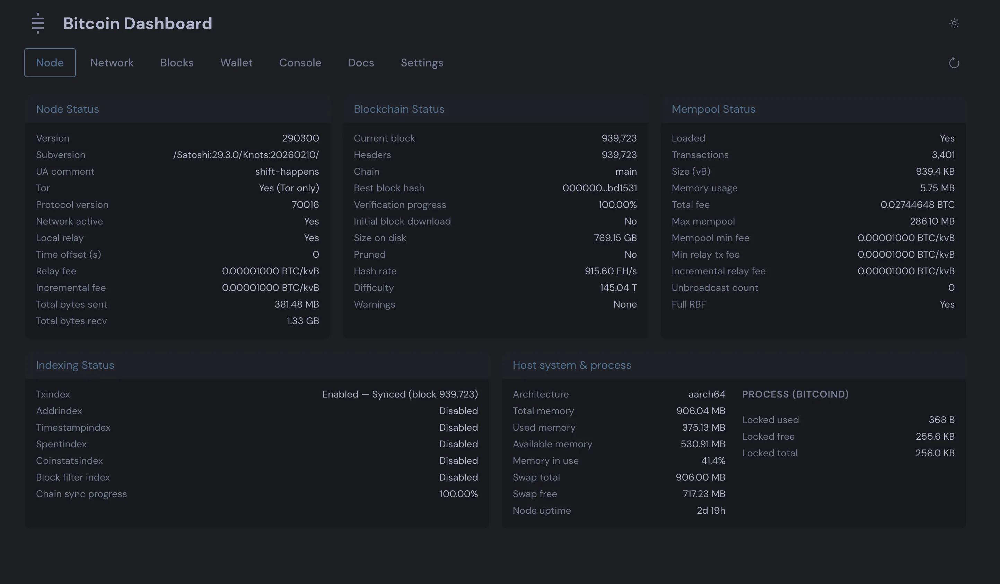
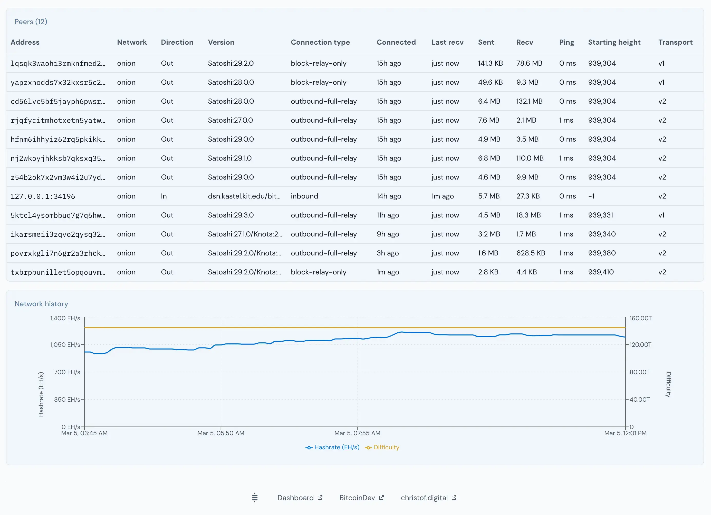
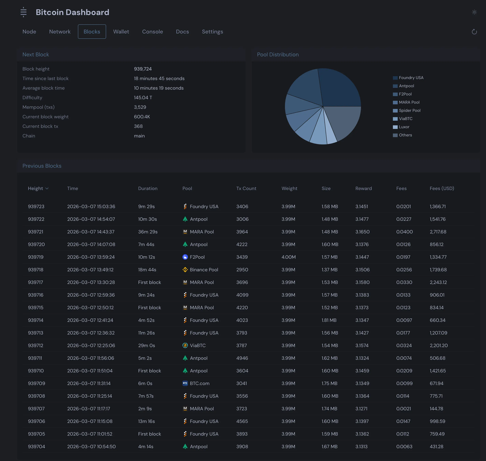
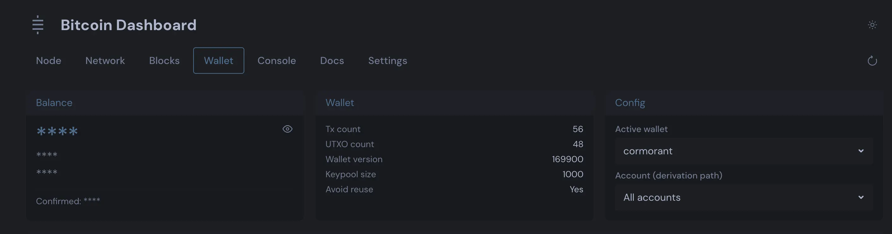
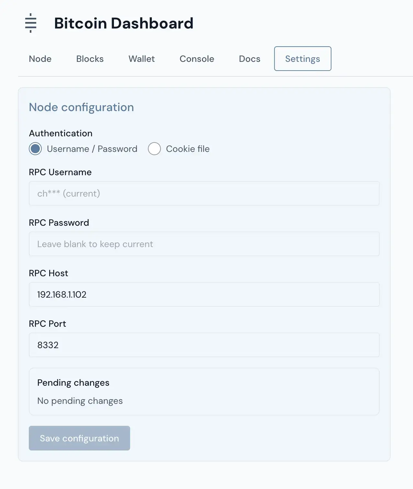
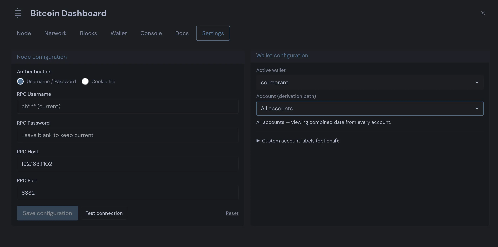

# Node Monitor – Bitcoin Node Monitoring Tools

A suite of tools for monitoring Bitcoin blockchain activity.

---

## Features

### Blockchain Monitoring

- **Real-time blockchain monitoring** with ZMQ notifications (instant) or polling fallback
- **Enhanced block detection** - catches blocks immediately as they're found
- **Block statistics** with SQLite storage (`data/node_monitor.db`, last 100 blocks) and pool distribution
- **Mining pool identification** from coinbase transactions
- **OP_RETURN data extraction** and analysis

---

## Screenshots








---

## Setup

1. **Install JavaScript dependencies (for web dashboard):**
   ```bash
   npm install
   ```
2. **Create a virtual environment and install Python dependencies:**
   ```bash
   python3 -m venv venv
   source venv/bin/activate
   pip install -r backend/requirements.txt
   ```
3. **Configure ZMQ for real-time monitoring (optional but recommended):**  
   In `bitcoin.conf` add the following (then restart your node):

       zmqpubhashblock=tcp://0.0.0.0:28332
       zmqpubhashtx=tcp://0.0.0.0:28333
       zmqpubrawblock=tcp://0.0.0.0:28334
       zmqpubrawtx=tcp://0.0.0.0:28335
4. **Configure secure RPC credentials:**
   ```bash
   python3 backend/config_service.py --setup
   ```

---


## Usage

### Web Dashboard

```bash
npm run dev
```

This starts the Vite dev server and the Python API server; `npm run dev` uses `./venv/bin/python3` so the same environment is used every time. The dashboard proxies `/api` to the API server.

**Environment variables** (optional overrides when running the API or block monitor):

| Variable | Used by | Description |
|----------|---------|-------------|
| `RPC_HOST` | RPC / API | Override Bitcoin RPC host (e.g. localhost or 192.168.1.5). |
| `RPC_PORT` | RPC / API | Override Bitcoin RPC port (default 8332). |
| `ZMQ_ENDPOINT` | API (block monitor) | ZMQ endpoint for block notifications (default: `tcp://127.0.0.1:28332`). |
| `POOLS_API_URL` | Block monitor | URL for pool signatures; set automatically when monitor runs inside the API. |
| `BITCOIN_DATADIR` | Config service | Path to Bitcoin datadir for cookie-file discovery. |
| `VITE_API_BASE_URL` | Frontend (build) | Override API base URL (default: `/api`). |

### Production
**Production / systemd:** Use the service files in `deploy/` for the API (port 8003) and dashboard (port 8002). The block monitor runs inside the API process and writes to SQLite.

```bash
sudo cp deploy/node-monitor-api.service deploy/node-monitor-web.service /etc/systemd/system/

sudo systemctl daemon-reload
sudo systemctl enable --now node-monitor-api node-monitor-web

sudo systemctl start node-monitor-web node-monitor-api
sudo systemctl restart node-monitor-web node-monitor-api
sudo systemctl status node-monitor-web node-monitor-api
```

**Production build:** `npm run build` — then serve the contents of `frontend/dist/`.

---

### Block and network data (SQLite)

Blocks, network history (hashrate/difficulty), and pool distribution are stored in `**data/node_monitor.db`** (SQLite). When you run the dashboard, the API server starts the block monitor in a background thread and writes to this DB. The DB is created automatically; the last 100 blocks and 100 network snapshots are kept. The API serves pool signatures at `/api/pools/signatures` and the block monitor uses that when running in-process (or set `POOLS_API_URL` for standalone monitoring).

```bash
cd /home/pi/projects/node-monitor   # or your repo path
sqlite3 data/node_monitor.db
```

Then run `.tables` to list tables (`blocks`, `network_history`), or for example:

```sql
SELECT block_height, block_hash, created_at FROM blocks ORDER BY block_height DESC LIMIT 5;
SELECT * FROM network_history ORDER BY id DESC LIMIT 5;
```

Type `.quit` to exit.

---

### Real-time block notifications (polling)

The API exposes a lightweight endpoint at **`GET /api/chain-tip`** so the dashboard can show new-block notifications without a long-lived stream.

- **Endpoint:** `GET /api/chain-tip`
- **Response:** JSON payload with latest observed tip (e.g. `height`, `hash`, `mining_pool`, `transaction_count`, `updated_at`).
- **Usage:** The frontend polls this endpoint every 5 seconds and shows a short-lived notification (slide-in from top, 5 seconds, then slide-out) when `height` increases.

When the block monitor runs inside the API process, it updates this chain-tip state as soon as a new block is persisted to SQLite, so notifications remain near real-time while keeping API impact low.

---

### How to enable Tor

Enabling Tor lets your **Bitcoin node** connect to the network over Tor (and optionally accept incoming connections from other Tor nodes). node-monitor does not run Tor itself; it only talks to your node via RPC (and ZMQ) on the host you configured.

**1. Install and start Tor**

- **Raspberry Pi / Debian:**  
  ```bash
  sudo apt update && sudo apt install -y tor
  sudo systemctl enable --now tor
  ```
  Tor listens on `127.0.0.1:9050` (SOCKS5) by default.
- **macOS (Homebrew):**  
  ```bash
  brew install tor
  brew services start tor
  ```

**2. Point Bitcoin Core at Tor**

In your node’s `bitcoin.conf` (e.g. `~/.bitcoin/bitcoin.conf` or the path used by your node):

```ini
# Use Tor for outbound connections
proxy=127.0.0.1:9050

# Optional: also accept incoming connections over Tor (run as a reachable node)
listen=1
onion=127.0.0.1:8336
```

Restart the Bitcoin node so it picks up the new settings. The node will then use Tor for outbound traffic; with `listen=1` and `onion=...` it can receive connections from other Tor nodes.

---

## Testing

Backend Python tests use **pytest** and live in `backend/tests/`.

**Run all backend tests (from repo root):**

```bash
pip3 install -r backend/requirements.txt
python3 -m pytest backend/tests -v
```

**Run with coverage:**

```bash
python3 -m pytest backend/tests -v --cov=backend --cov-report=term-missing
```

See `pytest.ini` at the repo root for `testpaths` and `pythonpath`.

---

## Code Quality

### Linting

The project uses automated code quality checks:

**Python (Pylint)**

```bash
# Check all Python files
cd backend && pylint *.py

# Configuration in backend/pylint.ini
```

**JavaScript (ESLint)**

```bash
# Check all JavaScript files
cd frontend && npm run lint

# Auto-fix issues
cd frontend && npm run lint:fix

# Configuration in frontend/.eslintrc.cjs
```

### Pre-commit Hooks

Git pre-commit hooks automatically run linting checks before each commit:

- **Pylint** checks all staged Python files
- **ESLint** checks all staged JavaScript files
- Commits are blocked if linting issues are found

The pre-commit hook is located at `.git/hooks/pre-commit` and runs automatically.
